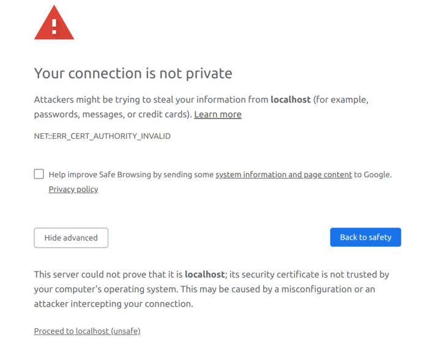
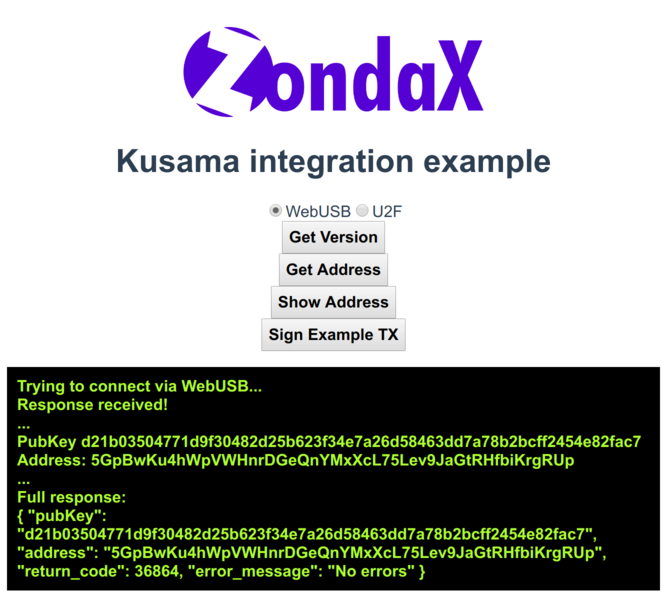

# ledger-polkadot-js

[](https://opensource.org/licenses/Apache-2.0)
[](https://badge.fury.io/js/ledger-polkadot)
[](https://circleci.com/gh/ZondaX/ledger-iov-js/tree/master)

This package provides a basic client library to communicate with the Kusama/Polkadot App running in a Ledger Nano S/X device

# Run Tests

- Prepare your Ledger device (https://github.com/zondax/ledger-polkadot)

  - Prepare as development device: 

  - Build & load the Kusama app

    - Load the Kusama App 

- Install all dependencies and run tests
```shell script
yarn install
yarn test:integration
```

# Run Vue example 
- Prepare your Ledger device (look at the previous section)

- Launch the vue app
```shell script
yarn serve
```

- U2F communication requires HTTPS. When launching the example, you find find something like:
 
     
     
- In the example you should be able to try different Ledger calls and check responses

     


